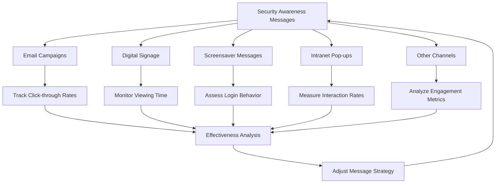

# Security Awareness Training Plan

**Organization**: St Clair College of Applied Arts & Technology  
**Course**: MIT 520 – Security II Lab 2  
**Version**: 1.1

## Table of Contents
1. [New Employee Training](#1-new-employee-training)
2. [Written Materials for New Employees](#2-written-materials-for-new-employees)
3. [Intranet Resources](#3-intranet-resources)
4. [Security Awareness Messages](#4-security-awareness-messages)
5. [Specialized IT Personnel Training](#5-specialized-it-personnel-training)
6. [Training Recordkeeping](#6-training-recordkeeping)
7. [Continuous Improvement](#7-continuous-improvement)

   ## 3. Intranet Resources

### 3.1 Security Portal

Design an intuitive, user-friendly security portal:

```
┌─────────────────────────────────────────────────────────┐
│                    SECURITY PORTAL                      │
├───────────────┬───────────────────┬─────────────────────┤
│ POLICIES      │ TRAINING          │ ALERTS & NEWS       │
├───────────────┼───────────────────┼─────────────────────┤
│ • Data        │ • Phishing Course │ • Latest Threats    │
│   Protection  │ • Password Safety │ • Security Tips     │
│ • BYOD Policy │ • Social Eng.     │ • Policy Updates    │
│ • Remote Work │   Awareness       │                     │
├───────────────┼───────────────────┼─────────────────────┤
│ REPORT AN     │ SECURITY TOOLS    │ CONTACT SECURITY    │
│ INCIDENT      │                   │                     │
└───────────────┴───────────────────┴─────────────────────┘
```

### 3.2 E-learning Modules

Develop a series of interactive e-learning modules:

1. **Phishing Awareness**: Interactive email scenarios
2. **Password Best Practices**: Password strength checker
3. **Social Engineering**: Role-playing game to identify tactics
4. **Data Protection**: Drag-and-drop exercise for data classification
5. **Mobile Device Security**: Interactive device setup guide

### 3.3 Reporting Tools

Create user-friendly forms for reporting security concerns:

- Incident Report Form
- Suspicious Email Submission
- Lost/Stolen Device Report
- Anonymous Tip Submission

   # Security Awareness Training Plan
## 4. Security Awareness Messages

Security awareness messages are crucial for maintaining a security-conscious culture within the organization. These messages should be diverse in content, format, and delivery method to ensure maximum engagement and retention.

### 4.1 Security Awareness Message Policies

###### Policy 1: Frequency and Timing
   - 1.1. Send email campaigns weekly, focusing on a single topic each time.
   - 1.2. Update digital signage and screensaver messages bi-weekly.
   - 1.3. Refresh physical posters and desktop wallpapers monthly.
   - 1.4. Post on internal social media platforms at least twice a week.

###### Policy 2: Content Creation and Approval
   - 2.1. All security awareness messages must be created or approved by the Information Security team.
   - 2.2. Messages should be clear, concise, and written in plain language.
   - 2.3. Include a call-to-action in each message when applicable.
   - 2.4. Ensure messages are culturally sensitive and inclusive.

###### Policy 3: Topic Coverage
   - 3.1. Rotate through the following topics throughout the year:
       a) Phishing and social engineering
       b) Password security
       c) Data protection and privacy
       d) Physical security
       e) Mobile device security
       f) Safe internet browsing
       g) Social media safety
       h) Incident reporting
   - 3.2. Align topics with current events and emerging threats when possible.

###### Policy 4: Visual Design
   - 4.1. Use a consistent color scheme and branding for all security messages.
   - 4.2. Incorporate infographics, icons, and images to enhance message retention.
   - 4.3. Ensure all visuals are accessible and comply with company standards.

###### Policy 5: Engagement and Feedback
   - 5.1. Include interactive elements in messages when possible (e.g., quizzes, polls).
   - 5.2. Encourage employees to provide feedback on the effectiveness of messages.
   - 5.3. Track engagement metrics for each type of message and adjust strategies accordingly.

### 4.3 Examples of Security Awareness Messages

#### Digital Signage Example

```
┌─────────────────────────────────────────────┐
│   🔐 PASSWORD SECURITY REMINDER 🔐         │
│                                             │
│   1. Use a unique password for each account │
│   2. Aim for at least 12 characters         │
│   3. Mix uppercase, lowercase, numbers, and │
│      symbols                                │
│   4. Consider using a password manager      │
│                                             │
│   Change your password if you suspect it's  │
│   been compromised!                         │
└─────────────────────────────────────────────┘
```

#### Screensaver Message Example

```
┌─────────────────────────────────────────────┐
│                                             │
│   🔒 LOCK YOUR SCREEN 🔒                   │
│                                             │
│   Protect company data when you step away   │
│                                             │
│   Windows: Win + L                          │
│   Mac: Control + Command + Q                │
│                                             │
│   Your security is in your hands!           │
│                                             │
└─────────────────────────────────────────────┘
```

#### Intranet Pop-up Example

```
┌─────────────────────────────────────────────┐
│   🚨 SECURITY ALERT 🚨                     │
│                                             │
│   New phishing campaign detected targeting  │
│   our organization.                         │
│                                             │
│   Subject: "Urgent: Update Your Credentials"│
│                                             │
│   If you receive this email, DO NOT click   │
│   any links. Report it immediately to the   │
│   security team.                            │
│                                             │
│   [Report Suspicious Email]  [Dismiss]      │
└─────────────────────────────────────────────┘
```



##### Safety conclusions

By implementing these policies and leveraging various message types, the organization can maintain a strong security awareness culture. Regular assessment and adjustment of the awareness program will ensure its continued effectiveness in the face of evolving security threats.

## Continuous Improvement

### Feedback Mechanism

Implement a structured feedback process:

1. Post-training surveys
2. Monthly security awareness quizzes
3. Annual security culture assessment

### 7.2 Annual Review

Conduct a comprehensive annual review:

1. Analyze training effectiveness metrics
2. Review security incident trends
3. Assess changes in threat landscape
4. Update training materials and policies
5. Set new goals for the upcoming year

Remember to tailor this plan to your specific organizational needs and culture. Regularly update the content to reflect new threats, technologies, and best practices in the ever-evolving field of cybersecurity.
