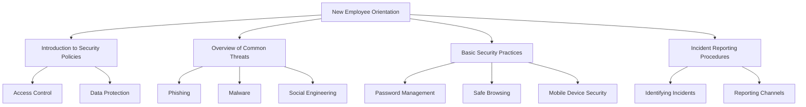
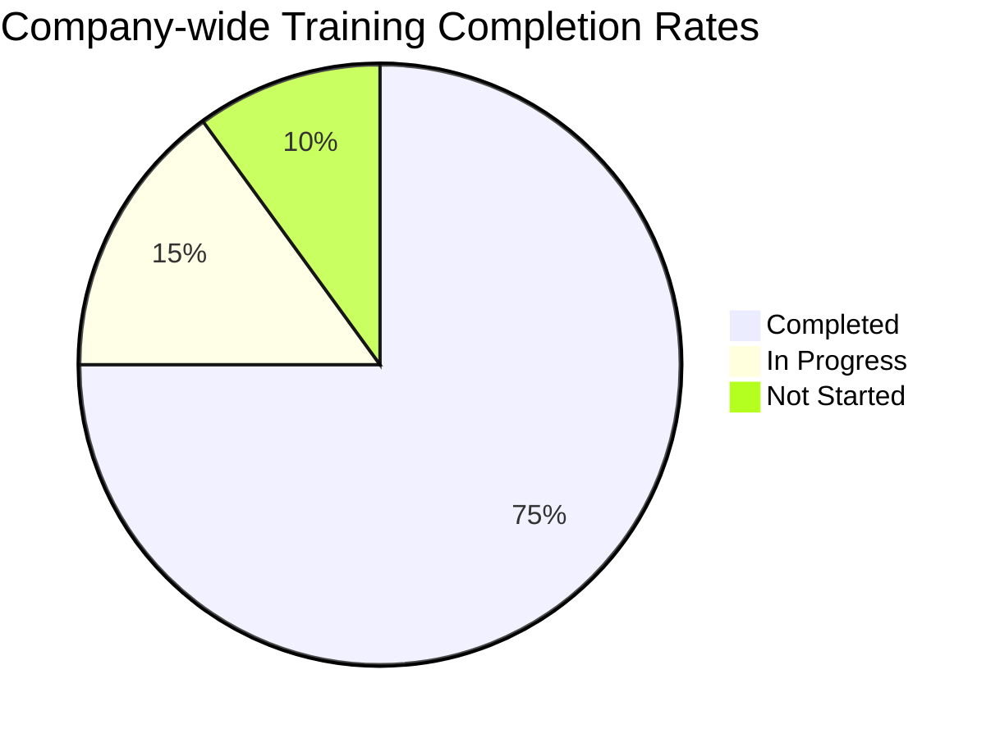

# Security Awareness Training Plan

**Organization**: St Clair College of Applied Arts & Technology  
**Course**: MIT 520 – Security II Lab 2  
**Group**: [Insert Group Name]  
**Date**: [Insert Creation Date]  
**Version**: 1.1

## Table of Contents
1. [New Employee Training](#1-new-employee-training)
2. [Written Materials for New Employees](#2-written-materials-for-new-employees)
3. [Intranet Resources](#3-intranet-resources)
4. [Security Awareness Messages](#4-security-awareness-messages)
5. [Specialized IT Personnel Training](#5-specialized-it-personnel-training)
6. [Training Recordkeeping](#6-training-recordkeeping)
7. [Continuous Improvement](#7-continuous-improvement)

## 1. New Employee Training

### 1.1 Orientation Session



#### Detailed Content:
- **Introduction to Security Policies**: 
  - Explain the company's overall approach to security
  - Highlight key policies (e.g., Acceptable Use Policy, Data Classification Policy)
- **Overview of Common Threats**:
  - Provide real-world examples of security breaches and their consequences
  - Discuss the most prevalent threats facing the organization
- **Basic Security Practices**:
  - Demonstrate strong password creation techniques
  - Show how to identify phishing emails with practical examples
  - Explain the importance of software updates and patch management
- **Incident Reporting Procedures**:
  - Walk through the step-by-step process for reporting a security incident
  - Introduce the security team and their roles

### 1.2 Hands-on Training

Organize interactive sessions where employees can:
- Practice creating strong passwords
- Identify phishing emails in a simulated environment
- Learn proper data handling procedures with mock sensitive information
- Navigate the company's security software and tools

## 2. Written Materials for New Employees

### 2.1 Security Policy Handbook

Create a comprehensive yet accessible handbook that includes:

1. **Company Security Philosophy**: Overview of the organization's approach to security
2. **Employee Responsibilities**: Clear outline of what's expected from every employee
3. **Data Classification Guide**: How to identify and handle different types of sensitive information
4. **Acceptable Use Policies**: Guidelines for using company resources (email, internet, devices)
5. **Incident Response Procedures**: Steps to take in case of a security breach or suspicious activity
6. **Contact Information**: Key security personnel and reporting channels

### 2.2 Quick Reference Guide

Design a visually appealing one-page guide:

```
┌─────────────────────────────────────────────────────┐
│           SECURITY QUICK REFERENCE GUIDE            │
├─────────────────┬─────────────────┬─────────────────┤
│   PASSWORDS     │    PHISHING     │  DATA HANDLING  │
├─────────────────┼─────────────────┼─────────────────┤
│ • Use 12+ chars │ • Check sender  │ • Lock screens  │
│ • Mix characters│ • Hover links   │ • Encrypt emails│
│ • Unique for    │ • No urgency    │ • Shred papers  │
│   each account  │ • Grammar check │ • Use secure    │
│                 │                 │   file sharing  │
├─────────────────┴─────────────────┴─────────────────┤
│        REPORT INCIDENTS: security@company.com       │
│        EMERGENCY HOTLINE: +1 (555) 123-4567         │
└─────────────────────────────────────────────────────┘
```

## 3. Intranet Resources

### 3.1 Security Portal

Design an intuitive, user-friendly security portal:

```
┌─────────────────────────────────────────────────────────┐
│                    SECURITY PORTAL                      │
├───────────────┬───────────────────┬─────────────────────┤
│ POLICIES      │ TRAINING          │ ALERTS & NEWS       │
├───────────────┼───────────────────┼─────────────────────┤
│ • Data        │ • Phishing Course │ • Latest Threats    │
│   Protection  │ • Password Safety │ • Security Tips     │
│ • BYOD Policy │ • Social Eng.     │ • Policy Updates    │
│ • Remote Work │   Awareness       │                     │
├───────────────┼───────────────────┼─────────────────────┤
│ REPORT AN     │ SECURITY TOOLS    │ CONTACT SECURITY    │
│ INCIDENT      │                   │                     │
└───────────────┴───────────────────┴─────────────────────┘
```

### 3.2 E-learning Modules

Develop a series of interactive e-learning modules:

1. **Phishing Awareness**: Interactive email scenarios
2. **Password Best Practices**: Password strength checker
3. **Social Engineering**: Role-playing game to identify tactics
4. **Data Protection**: Drag-and-drop exercise for data classification
5. **Mobile Device Security**: Interactive device setup guide

### 3.3 Reporting Tools

Create user-friendly forms for reporting security concerns:

- Incident Report Form
- Suspicious Email Submission
- Lost/Stolen Device Report
- Anonymous Tip Submission

## 4. Security Awareness Messages

### 4.1 Regular Email Updates

Sample email template:

```
Subject: Weekly Security Tip: Spotting Phishing Emails

Dear [Employee Name],

This week's security tip focuses on identifying phishing emails:

🚩 Red Flags to Watch For:
   • Urgent action required
   • Unexpected attachments
   • Requests for sensitive information
   • Mismatched or suspicious URLs

🔍 Before clicking any links, hover over them to verify 
   the true destination.

Stay vigilant and report any suspicious emails to 
security@company.com.

Stay secure!
[Company] Security Team
```

### 4.2 Digital Signage

Rotate eye-catching security messages on office displays:

```
┌─────────────────────────────────────────────┐
│   🔒 SECURITY TIP OF THE DAY 🔒   │
│                                             │
│   "If you connect it, protect it!"          │
│                                             │
│   Ensure all your devices are up-to-date    │
│   with the latest security patches.         │
└─────────────────────────────────────────────┘
```

### 4.3 Screensaver Messages

Design engaging screensavers with security reminders:

```
┌─────────────────────────────────────────────┐
│     📵                                      │
│     LOCK YOUR SCREEN                        │
│     WHEN YOU LEAVE YOUR DESK                │
│                                             │
│     Windows Key + L                         │
└─────────────────────────────────────────────┘
```

## 5. Specialized IT Personnel Training

### 5.1 Advanced Technical Training

Develop a structured training path for IT personnel:

1. Network Security
   - Firewall configuration
   - Intrusion detection systems
   - VPN setup and management
2. Encryption Technologies
   - Public key infrastructure
   - Data-at-rest encryption
   - Secure communication protocols
3. Cloud Security
   - Security in major cloud platforms (AWS, Azure, GCP)
   - Cloud access security brokers (CASBs)
   - Container security

### 5.2 Incident Response Training

Create realistic scenarios for hands-on practice:

1. Simulated Phishing Attack
2. Ransomware Outbreak
3. Data Breach Response
4. DDoS Attack Mitigation
5. Insider Threat Detection

### 5.3 Compliance and Regulatory Training

Offer specialized courses on relevant regulations:

- GDPR Compliance Workshop
- HIPAA Security Rule Training
- PCI DSS Implementation Guide
- SOC 2 Audit Preparation

## 6. Training Recordkeeping

### 6.1 Learning Management System (LMS)

Implement a comprehensive LMS with features such as:

- Course enrollment and tracking
- Automated reminders for due/overdue training
- Integration with HR systems
- Analytics dashboard for training metrics

### 6.2 Attendance Logs

Maintain detailed logs for in-person training:

```
| Date       | Training Topic        | Trainer     | Attendees        |
|------------|------------------------|-------------|------------------|
| 2024-09-15 | Incident Response      | Jane Doe    | [List of Names]  |
| 2024-09-22 | Social Engineering     | John Smith  | [List of Names]  |
```

### 6.3 Compliance Reports

Generate regular reports to track training compliance:



### 6.4 Individual Training Records

Maintain comprehensive records for each employee:

```
Employee Training Record

Name: Alice Johnson
Department: Marketing
Hire Date: 2024-03-01

Completed Trainings:
1. New Employee Security Orientation (2024-03-02)
2. Phishing Awareness (2024-04-15)
3. Data Protection Basics (2024-05-10)

Certifications:
- Certified Information Systems Security Professional (CISSP)
  Date: 2024-08-01, Expiry: 2027-08-01

Pending Trainings:
1. Annual Security Refresher (Due: 2025-03-01)
```

## 7. Continuous Improvement

### 7.1 Feedback Mechanism

Implement a structured feedback process:

1. Post-training surveys
2. Monthly security awareness quizzes
3. Annual security culture assessment

### 7.2 Annual Review

Conduct a comprehensive annual review:

1. Analyze training effectiveness metrics
2. Review security incident trends
3. Assess changes in threat landscape
4. Update training materials and policies
5. Set new goals for the upcoming year

Remember to tailor this plan to your specific organizational needs and culture. Regularly update the content to reflect new threats, technologies, and best practices in the ever-evolving field of cybersecurity.
