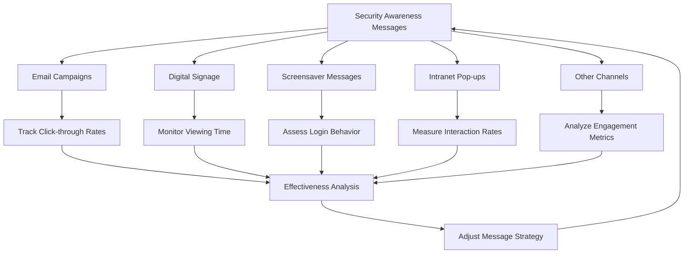

# Security Awareness Training Plan
## 4. Security Awareness Messages

Security awareness messages are crucial for maintaining a security-conscious culture within the organization. These messages should be diverse in content, format, and delivery method to ensure maximum engagement and retention.

### 4.1 Security Awareness Message Policies

###### Policy 1: Frequency and Timing
   - 1.1. Send email campaigns weekly, focusing on a single topic each time.
   - 1.2. Update digital signage and screensaver messages bi-weekly.
   - 1.3. Refresh physical posters and desktop wallpapers monthly.
   - 1.4. Post on internal social media platforms at least twice a week.

###### Policy 2: Content Creation and Approval
   - 2.1. All security awareness messages must be created or approved by the Information Security team.
   - 2.2. Messages should be clear, concise, and written in plain language.
   - 2.3. Include a call-to-action in each message when applicable.
   - 2.4. Ensure messages are culturally sensitive and inclusive.

###### Policy 3: Topic Coverage
   - 3.1. Rotate through the following topics throughout the year:
       a) Phishing and social engineering
       b) Password security
       c) Data protection and privacy
       d) Physical security
       e) Mobile device security
       f) Safe internet browsing
       g) Social media safety
       h) Incident reporting
   - 3.2. Align topics with current events and emerging threats when possible.

###### Policy 4: Visual Design
   - 4.1. Use a consistent color scheme and branding for all security messages.
   - 4.2. Incorporate infographics, icons, and images to enhance message retention.
   - 4.3. Ensure all visuals are accessible and comply with company standards.

###### Policy 5: Engagement and Feedback
   - 5.1. Include interactive elements in messages when possible (e.g., quizzes, polls).
   - 5.2. Encourage employees to provide feedback on the effectiveness of messages.
   - 5.3. Track engagement metrics for each type of message and adjust strategies accordingly.

### 4.3 Examples of Security Awareness Messages

#### Digital Signage Example

```
┌─────────────────────────────────────────────┐
│   🔐 PASSWORD SECURITY REMINDER 🔐         │
│                                             │
│   1. Use a unique password for each account │
│   2. Aim for at least 12 characters         │
│   3. Mix uppercase, lowercase, numbers, and │
│      symbols                                │
│   4. Consider using a password manager      │
│                                             │
│   Change your password if you suspect it's  │
│   been compromised!                         │
└─────────────────────────────────────────────┘
```

#### Screensaver Message Example

```
┌─────────────────────────────────────────────┐
│                                             │
│   🔒 LOCK YOUR SCREEN 🔒                   │
│                                             │
│   Protect company data when you step away   │
│                                             │
│   Windows: Win + L                          │
│   Mac: Control + Command + Q                │
│                                             │
│   Your security is in your hands!           │
│                                             │
└─────────────────────────────────────────────┘
```

#### Intranet Pop-up Example

```
┌─────────────────────────────────────────────┐
│   🚨 SECURITY ALERT 🚨                     │
│                                             │
│   New phishing campaign detected targeting  │
│   our organization.                         │
│                                             │
│   Subject: "Urgent: Update Your Credentials"│
│                                             │
│   If you receive this email, DO NOT click   │
│   any links. Report it immediately to the   │
│   security team.                            │
│                                             │
│   [Report Suspicious Email]  [Dismiss]      │
└─────────────────────────────────────────────┘
```



##### Safety conclusions

By implementing these policies and leveraging various message types, the organization can maintain a strong security awareness culture. Regular assessment and adjustment of the awareness program will ensure its continued effectiveness in the face of evolving security threats.
